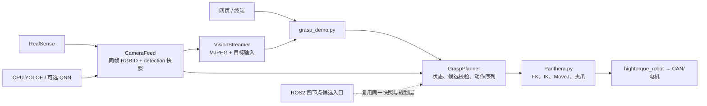

# Panthera-HT 彩色积木视觉抓取

这是运行在 IQ9075/AArch64 板端的 Panthera-HT 六轴机械臂抓取项目。默认流程为：网页或终端选择颜色，RealSense + QNN NPU YOLOE 识别积木，机械臂到预抓取观察位重新识别和校正，再执行最终接近、验夹紧力和放置；成功后回到 HOME 并继续等待下一次目标选择，只有终端 `q`、网页结束按钮或异常才进入安全停机。语音模块暂时保留但默认关闭。

当前执行主线固定为单机单进程 `grasp_demo.py`。首次现场启动已确认相机、机械臂初始化和安全回零链路，但尚未完成一次全流程抓取验收；ROS2 代码仅保留备查，当前不作为运行入口。

## 2026-09-01 预抓取与 NPU 大修

本轮在已推送的 `beaa9f5` 标定抓取管线检查点上完成以下修改。代码已经通过离线回归，但尚未执行机械臂运动，因此仍不能描述为真机验收通过：

- 将眼在手相机的“观察运动”和夹爪的“最终接近”拆成两个阶段。观察阶段保留扫描时的相机/TCP 朝向，只校正相机坐标中一半的横向偏差和一半的可用深度，并限制单次横移、前进和总位移，避免复检前转走相机或跳过目标。
- 观察位不再依赖一帧检测。机械臂主动刷新电机反馈并确认停稳后，丢弃 3 帧预热图像，在最多 8 帧中取得 3 个同一物体的基座坐标观测；使用中位数、位置离散度、修正量和姿态变化共同验收。观察运动有安全位移上限，因此复检中心半径放宽为 `220 px`，但基座坐标 `50 mm` 身份门槛仍是主约束。已识别目标若在近距离被 YOLO 临时漏检，只允许指定颜色的连通区域作为复检候选，并继续通过基座坐标保持目标身份。
- 最终预抓取退距改为“当前夹爪末端到目标的有符号抓取轴间隙 × `0.50`”，再限制到 `15..40 mm`。这里不用三维欧氏距离，因为横向误差不属于直线接近的退距；横向误差和姿态仍由独立走廊约束检查。
- 真机日志显示预抓取 MoveJ 会在关节到位容差内完成，但 TCP 仍可能残留 `16..27 mm` 横向误差，因而被 `15 mm` 的直线接近入口门槛安全拒绝。现在若反馈偏出走廊，会先在 `15..40 mm` 安全退距内执行最多 `45 mm` 的短笛卡尔对正，再重新测量并执行严格轴向直线接近。
- 后续真机验证表明 `0.02 rad` 超出了当前电机的稳定重复到位能力，连续两次出现预抓取超时；现回调为 `0.04 rad`，残余位置误差继续交给短笛卡尔对正处理。最终路径现在分别检查“相对命令起终点线段的真实跑偏”和“相对抓取轴且正在收敛的横向误差”；日志中反复出现的 `7.1..7.7 mm` 是从残余偏置向目标收敛形成的斜线段，不再被错误当成离开路径。预抓取入口的 `15 mm` 门槛和所有终点、工作空间及关节检查保持不变。
- 网页标题改为“Panthera 抓取”，删除常驻安全勾选框；开始抓取时仍有现场安全确认提示。视觉区左右新增 J1 箭头：左箭头 `+0.5 rad`、右箭头 `-0.5 rad`，到关节边界自动钳制。转动请求只会在主程序等待目标、机械臂静止且 2–6 号关节接近 HOME 形状时由机器人主线程串行执行，抓取进行中不能提交。
- 最终闭爪前新增 `[ACCURACY]` 日志，分别记录“实际 TCP－软件目标”“软件目标－检测物体”和“实际 TCP－检测物体”的 Base XYZ 毫米值。`5 mm` 工具轴前探真机试验确实产生了可见的向前动作，但在倾斜抓取姿态下同时带来约 `-4 mm` 向下分量；蓝色抓取的实际 TCP－物体由前一轮 `[146.5, 38.9, -71.5] mm` 变为 `[146.8, 39.8, -79.1] mm`，没有改善横向偏差且明显加深 Z。因此默认前探恢复为 `0 mm`，保留配置开关但不继续叠加未验证物理常量。
- 到达 `15..40 mm` 安全预抓取退距并完成笛卡尔对正后，执行三帧近距位置复检。现场确认 Base-Y 无稳定偏差后，近距结果只动态修正 Base-X/Z，并保留远距 Base-Y 和抓取姿态；目标深度小于 `75 mm`、框触边、框面积超过画面 `30%`、深度离散超过 `15 mm`、三帧位置离散超过 `9 mm`，或 X/Z/总修正超过 `35/18/35 mm` 时跳过近距结果。这样可接纳日志中一致的约 `13..17 mm` X、约 `15 mm` Z 修正，同时不会把近景透视产生的约 `12 mm` 假 Y 偏差写进目标。
- 笛卡尔路径继续使用不越过关节采样范围的 PCHIP 作 `50 Hz` 控制重采样，平滑启停并逐点复查速度、加速度和关节限位。最新真机日志进一步定位了“掉电式下坠”：四轮均在 MIT 对正轨迹结束后切换到 `Joint_Pos_Vel` 保持时发生，关节漂移稳定扩大到 `0.0390..0.0408 rad`，并非电机、CAN 或供电故障。现在轨迹后的相机等待、开/闭夹爪保持均继续使用相同 MIT 增益和重力补偿，MoveJ 后才使用 `Joint_Pos_Vel`，不再跨控制器硬切换。
- 相机预热、远距/近距多帧复检和移动后停稳期间，以 `20 Hz` 持续刷新与当前控制模式一致的六轴零速度保持；每段结束检查关节漂移。轨迹下发前还会比较当前反馈与已验证首点，超过 `0.025 rad` 或 TCP `10 mm` 就拒绝陈旧轨迹。最终 `15..40 mm` 接近由 `5.0 s` 缩短为 `3.5 s`，密集执行器仍会在动作前拒绝超速或超加速度轨迹。
- 修复“姿态正确但总夹积木尾部”：原位置射线取自掩膜中最靠近相机的深度像素簇；积木倾斜时该簇天然落在近端/尾部，可造成约 2–3 cm 图像投影偏移。现在抓取射线使用分割 OBB 几何中心，深度仍取稳健近表面，并在日志打印 `Depth pixel` 与 `OBB-centre correction`。这修正目标点定义，不重新引入固定 Base XYZ 补偿。
- 修复最终轨迹后的到位等待：日志中两次出现轨迹刚结束时最大关节误差约 `0.02..0.03 rad`，随后零速度 `Joint_Pos_Vel` 重发反而扩大到 `0.0395/0.0417 rad` 并退出。现在只被动确认关节停稳，并以 `12 mm` 实际 TCP 残差作为闭爪前的最终笛卡尔门槛；失败会打开夹爪并按预抓取重试，重试耗尽后回 HOME，不再终止主程序。
- 修复正常退出后 D405 短时间仍被占用：停止相机时先释放 RealSense pipeline，再等待采集线程结束，避免下一次启动连续出现 `VIDIOC_S_FMT ... Device or resource busy`。
- 网页只发布完成推理的同帧 RGB-D/检测快照，不再把上一帧 YOLO 框画到最新采集帧上。视觉日志增加 NPU 阈值前候选数和 NMS 后数量。
- NPU 解码增加非有限输出、非整数/越界类别、无效及画面外框过滤，并在映射到原图后执行 class-agnostic NMS。四个提示词是编译进 `block4` context 的通用积木同义词，class-agnostic NMS 会合并同一物体的同义词重复框。
- 修复“识别后页面和终端像卡死”：此前外层遍历 2–3 个 IK seed，而每个 seed 内部又启动 8 初始值、最多 1000 次迭代，多个规划阶段叠加后会长时间占用 Python 线程；弱颜色证据也会为每个无关候选分别等待多帧。现在 IK 只按最多 3 个去重后的显式 seed 求解，每个最多 600 次迭代并打印耗时；颜色累计共享 `1.0 s` 总预算，复检共享 `4.0 s` 总预算。MoveJ 会在下发前后输出阶段日志，反馈等待限制为“动作时长 + 4 秒”且最少 6 秒。必要的 workspace、IK/FK、关节跳变和笛卡尔路径校验均保留。
- 实机日志确认 NPU 为 `8..12 FPS`，首次 OBB IK 只需 `0.01 s`；此前约 11 秒延迟主要来自“无条件先去 `J1=+1.8` 再逐点扫描”，而非解算。现在先在当前稳定姿态获取一帧并验证目标，成功即进入抓取，只有当前画面没有目标时才启动 J1 扫描兜底。
- 相机观察位不再套用最终抓取区域的 `tool X/radius` 下限。观察运动本质是从一个已知安全扫描姿态出发的不超过 `45 mm` 的局部移动，现在只使用当前关节作为 seed，并限制最大关节变化 `0.75 rad`；局部 IK 不可用时保持原位继续 3 帧复检，不再整轮回退。

只读参考 `/home/ubuntu/work/grasp_demo17.py` 的关键经验是：近距离复检前保持相机朝向、小步移动、多帧确认。项目没有复制其单类别低阈值检测器，因为静态场景对照显示项目 `block4` 在 `0.15` 阈值下召回 4 个积木，而单类别 context 只召回 2 个；四标签 context 的单帧耗时只比单类别样本多约 `16 ms`。因此“标签太多”不是当前主要故障证据，更应继续采集不同距离、角度和遮挡下的精确率/召回率。

## 架构与数据边界



控制链与图像编码链分离。`VisionStreamer` 的 JPEG 编码在 HTTP 线程中完成，编码失败不会阻塞机械臂规划；网页提交的目标只进入一个受控命令槽，并由主循环解析。当前网页默认监听局域网 `0.0.0.0`，没有身份认证，只允许用于可信隔离局域网，不应转发端口或暴露到不受信网络。

## 默认单体流程

根入口是 `grasp_demo.py`：

1. 读取配置、启动展示旁路和 RealSense，再加载 NPU/CPU 视觉后端；视觉后端失败发生在机械臂初始化之前。
2. 创建 Panthera 机械臂拥有者和 `GraspPlanner`；后续异常统一进入清理路径。
3. 回 HOME、打开夹爪；通过终端或推流网页选择红/黄/蓝/绿/白/黑或任意颜色。网页只有在主程序处于“等待目标”阶段才接受提交，并保留浏览器二次确认。
4. 首先在当前稳定姿态执行一次 `[FAST]` 检测；页面已经看见且通过颜色、深度、工作空间和 IK 验证的目标无需扫描运动。仅当快速检测失败时，J1 才按兜底范围从 `+1.80` 扫到 `-1.80 rad`，步长 `0.30 rad`。每个位置只使用新推理快照，绝不复用陈旧检测。
5. 默认 OBB/Seeed 后端，或显式启用 GraspNet；两者都会进入同一个 workspace、IK、FK 误差和关节跳变校验。
6. 首次识别后先规划相机观察位：保持当前相机/TCP 朝向，横向校正增益 `0.50`，轴向取“当前深度减最小可视距离”的 `0.50`，轴向最多前进 `25 mm`、横向最多 `35 mm`、总位移最多 `45 mm`。小于 `8 mm` 的观察运动会跳过，但多帧复检仍执行。
7. 复检需要 3 个同一物体观测，基座坐标匹配半径 `50 mm`，最大离散度 `12 mm`，XY/Z/总修正分别限制为 `35/20/35 mm`。超过限制、姿态突变、深度无效或 IK 不可达均回到最后识别位并重新开放页面，而不是让主程序异常退出。
8. 复检完成后才切换最终抓取姿态。预抓取退距取当前有符号抓取轴间隙的一半，并钳制为 `15..40 mm`；MoveJ 使用 `0.04 rad` 到位容差。若实际 TCP 横向误差仍超过 `15 mm`，程序不会直接放弃或斜向下探，而会在安全退距处规划最多 `45 mm` 的笛卡尔对正轨迹；轨迹须逐点满足关节、工作空间、姿态、轴向安全和向目标收敛检查，随后再次读取实机反馈。
9. 对正后在安全退距处执行三帧近距位置复检；仅在目标完整可见、深度有效且修正一致时动态更新 Base-X/Z，Base-Y 与抓取姿态保持远距结果。随后按 `2 mm` 几何采样最终笛卡尔路径，再以 `20 ms` 周期重采样为形状保持、零端点速度的控制轨迹；整段必须 100% 完成，逐点通过关节限位、速度/加速度、跳变、FK、工作空间、轴向单调、命令线段跑偏和抓取轴横向收敛检查。闭爪前还会读取实机 FK，实际 TCP 对软件目标超过 `12 mm` 时放弃本轮并进入同一套预抓取重试；重试耗尽后回 HOME。
10. 抓取后检查夹爪位置/力矩；第一次未形成有效夹持或力不足时，打开夹爪并沿刚刚验证的笛卡尔接近路径反向退回预抓取点，在该位置重新取得同一目标的三帧 RGB-D 坐标并修正后再抓一次，不再先回远处扫描位。反向路径从真实反馈起步、只保留远离物体且仍在接近走廊内的采样；第二次仍失败、预抓取复检失败或无法形成安全重试路径时，打开夹爪并回 HOME，重新开放页面/终端选择。成功后按 `当前抓取位 → PUT2（保持夹紧）→ PUT1（保持夹紧）→ PUT1 释放 → PUT2（松开）→ HOME（松开）` 执行，清除上一目标并重新开放选择，不结束程序。如果网页停止请求在持物转运途中到达，会先在 PUT1 完成安全释放，再由停机流程返回程序启动姿态；释放后的第二次 PUT2/HOME 循环动作可跳过。
11. `grasp_demo.py` 在接管机械臂后、执行 HOME 前立即记录六轴真实关节姿态。正常完成、网页结束、信号和异常路径都会调用有限时的 `safe_shutdown()`：先返回这份“程序启动前姿态”，确认位置/速度后 `set_stop()`。若反馈丢失，只在成功读取当前关节时做一次短暂保持后停机。ROS 兼容入口未提供启动快照时仍保留 ZERO 回退语义。

## 网页推流与目标输入

主程序启动后会打印实际地址，通常为：

```text
http://192.168.1.102:8080/
```

页面采用左右布局：左侧显示与彩色帧对齐的深度伪彩画面和深度范围/中值，右侧显示 YOLO 标注画面。标注包含检测置信度、颜色置信度、颜色累计帧数和目标深度。窄屏设备会自动改为上下布局。操作步骤：

1. 等待页面状态显示主程序正在等待目标。
2. 从下拉框选择颜色，或输入“不要红色，要绿色积木”等文本。
3. 确认机械臂所有路径内无人、无障碍物。
4. 点击“开始抓取”并通过浏览器二次确认；提交成功后自动开始扫描。
5. 第一次未抓到物体时，机械臂退回预抓取点重新识别并修正；第二次仍失败后回到 HOME，再在同一页面选择下一个目标。
6. 需要正常结束时点击“结束程序并回启动姿态”；后端锁存一次请求、禁止继续提交目标，机械臂确认回到程序接管前的真实六轴姿态后停止电机。

网页按钮不是急停，也不能替代现场人员、硬件急停和安全围栏。网页没有登录鉴权；后端在非目标输入阶段拒绝请求，但同一可信局域网内能访问页面的人仍可能提交目标。

配置中的 HOME 是抓取流程工作姿态，不等同于“程序启动前姿态”。后者每次运行都从电机反馈动态记录，不能硬编码。`safe_shutdown()` 的故障回退是有限时间的，不会永久占用工作线程；它不替代现场急停、硬件限位或碰撞规划。

## 标定

项目根目录的 `hand_eye_calibration.json` 是唯一手眼标定来源。当前版本由只读来源文件复制而来：

```text
标定时间：2026-08-31 07:18:17
样本数：20
字段：T_tcp_camera
```

运行时使用：

```text
T_base_camera = T_base_joint6 × T_joint6_tcp × T_tcp_camera
T_joint6_tcp.translation = [0.165, 0.000, 0.000] m
```

831 标定是在只读参考 SDK 中完成的；该 SDK 的 FK 已经包含 165 mm 夹爪尖端偏移，所以保存的确实是 Camera→TCP。当前项目的 FK 为了让 IK 和笛卡尔路径使用明确的末端 frame，返回的是 joint6 原点，因此视觉链必须显式补上 `T_joint6_tcp`。这是一段会随腕部姿态旋转的三维刚体变换，不能用固定 Base-Z 或直接从相机深度减一个常数代替。单体和 ROS2 均指向同一项目内标定文件，没有第二份硬编码基座/手眼矩阵。

不要把尺子量到的相机/夹爪竖直距离直接写入 Base-Z 补偿。当前外参求逆后，TCP 原点在 RealSense 光学坐标系中约为 `[10.1, 30.2, 103.2] mm`；RealSense 的光学 Z 指向镜头前方（深度方向），画面竖直方向是光学 Y，因此约 3 cm 的机械竖直差已经体现在 Camera-Y 的 `30.2 mm` 中。HOME 姿态下矩阵投影还会改变各 Base 分量，必须使用完整刚体变换。

新旧标定的 TCP→Camera 变换约相差 1.93 mm、1.86°。更换相机、TCP、末端工具或机械臂基座后必须重新标定；仅复制 JSON 不构成真机验证。

## 目录

```text
pathera_grasp/
├── grasp_demo.py                         # 单体正式入口
├── voice_controller.py                   # 离线 ASR/TTS 半双工胶水层
├── hand_eye_calibration.json             # 当前手眼标定（唯一来源）
├── models/                               # YOLOE、SenseVoice、VITS 模型（Git LFS）
├── iq9075_speech/ iq9075_tts/ voice_demo/# 语音组件与独立演示
├── Panthera-HT_SDK/panthera_python/
│   └── scripts/Panthera_lib/
│       ├── Panthera.py                   # 电机、FK/IK、MoveJ
│       ├── grasp_config.py               # 共享配置/颜色解析
│       ├── grasp_planner.py              # 状态、候选验证、执行、停机
│       ├── vision_pipeline.py            # RGB-D 快照、检测、坐标/OBB
│       ├── graspnet_pipeline.py          # 可选 GraspNet 候选
│       ├── npu_inference.py              # QNN 进程/FIFO 健康检查
│       └── vision_streamer.py            # 网页 MJPEG
├── ros2_ws/src/                          # voice、vision、stream、grasp_brain、bringup
├── tools/test_graspnet_offline.py        # GraspNet 离线候选脚本
├── tools/run_offline_tests.py            # 标准库 unittest + 内存编译
└── tests/                                # 不接硬件的回归测试
```

`ros2_ws/` 仅作为暂停的兼容实现随检查点保存；不要同时启动它和 `grasp_demo.py`，否则会争用相机和机械臂。

## 配置与启动

项目目标环境：

```bash
source /home/ubuntu/miniconda3/etc/profile.d/conda.sh
conda activate pathera_grasp
cd /home/ubuntu/A_shen_arm/pathera_grasp
export VOICE_INPUT=0
export YOLO_NPU=1
export GRASPNET_USE=0
python grasp_demo.py
```

上面的主流程会触发硬件，必须在单独授权和现场安全检查后才可执行。本次没有执行它。

常用环境变量：

| 变量 | 默认 | 用途 |
|---|---:|---|
| `YOLOE_MODEL_PATH` | 项目内 `yoloe-26s-seg.pt` | CPU YOLOE 权重 |
| `YOLOE_TEXT_ENCODER_PATH` | `mobileclip2_b.ts` | YOLOE 文本编码器 |
| `YOLO_NPU` | `1` | 默认 QNN HTP NPU；设为 `0` 才使用慢速 CPU 回退 |
| `REALSENSE_SERIAL` | 空 | 多相机时绑定指定 RealSense 序列号 |
| `GRASPNET_USE` | `0` | 启用 GraspNet 候选 |
| `GRASPNET_CHECKPOINT_PATH` | 项目内 checkpoint | 覆盖 GraspNet 权重 |
| `VOICE_INPUT` | `0` | 暂缓整合；显式设为 `1` 才启用离线语音 |
| `VOICE_PROMPT_DURATION` | `3.5` | 单次语音录音时长 |
| `VISION_STREAM_HOST/PORT/JPEG_QUALITY` | `0.0.0.0/8080/92` | MJPEG 服务；相机采集保持稳定的 30 FPS，NPU 检测帧率由实际推理速度决定 |

`grasp_config.py` 中 `npu_response_timeout` 和 `npu_stderr_max_lines` 用于限制 QNN FIFO 阻塞和 stderr 内存；不再保留未实现的 GraspNet 点云半径、lift、可操作度或自动稳定样本伪配置。

当前夹爪安全范围保持为 `0.0..2.0 rad`；根据重新置零后反复验证的 `grasp_demo15.py`，完全打开目标更新为 `1.8 rad`，闭合目标为 `0.0 rad`，近闭合阈值为 `0.22 rad`。若再次执行电机零位标定，必须重新确认这些值。

HOME、PUT1、PUT2 保持已验证值。抓取补偿已从“坐标系补丁”迁移为仅表达夹爪与物体的剩余物理偏置：

```text
HOME         = [0.000, 0.240, 1.200, -1.515, 0.000, 0.000]
PUT1         = [1.600, 1.300, 0.550, -0.300, 0.000, 0.000]
PUT2         = [1.500, 0.500, 0.560, -0.075, 0.000, 0.000]
GRASP_OFFSET = [0.000, 0.000, 0.000] m（固定 Base XYZ 补偿全部关闭）
APPROACH_OVERTRAVEL = 0.000 m（5 mm 真机试验已撤回；机制保留）
```

与该补偿配套的工作空间保护同步为：tool X `0.10..0.60 m`、Y `-0.45..0.45 m`、Z `0.00..0.30 m`、径向 `0.10..0.65 m`。

旧补偿 `[0.150, 0.040, -0.070] m` 中混入了 HOME 姿态下缺失的 joint6→TCP 投影 `[0.1402, 0.0000, -0.0869] m`。现在坐标链已经显式包含该刚体变换，固定 Base XYZ 补偿全部归零。现场报告的 X 约 `30 mm`、Z 约 `10 mm` 偏差不再写成另一组永久常量，而由目标完整可见且三帧一致时的近距 RGB-D 结果逐次修正；近距结果不合格则保持已经验证的远距目标并安全继续。

## 视觉、GraspNet 与 NPU

- 默认检测改为 QNN HTP NPU。程序在机械臂初始化和运动之前加载视觉后端；NPU 启动失败时不会移动机械臂，可显式 `YOLO_NPU=0` 使用 CPU 回退。日志中的 `selected backend` 和周期性 `[VISION-PERF]` 会分别报告后端、相机采集 FPS、检测 FPS 与单帧推理耗时。
- NPU 使用从只读参考环境复制到项目内的 `yoloe-26s-seg_640_iq9075_qnn_block4.bin`，其四个编译提示词是通用积木同义词；颜色仍由 HSV 独立判断。旧 `brick6` 上下文把颜色写进检测提示词，与当前“先检测积木、再判色”的管线不匹配：在同一张四积木截图上即使阈值降到 `0.15` 仍输出 0 个候选。`block4` 在 `0.15` 下输出 4 个候选，单次 NPU 推理约 `0.085 s`，因此当前阈值设为 `0.15`，不是用降阈值掩盖 NPU 故障。
- NPU 后处理先拒绝非有限输出、非整数/越界类别和映射到画面后无效的 bbox，再执行 top-k 与 class-agnostic NMS，最后只为保留候选解码 prototype mask。FIFO 超时或短读后会立即关闭并毒化该检测器；由于协议没有 request id，禁止复用可能含迟到旧响应的连接。周期日志会显示 `npu_candidates=A->B`，用于区分“模型没有候选”和“候选被后处理过滤”。
- 相机仍从设备读取真实 `depth_scale`，不会把日志中的 `0.00010` 擅自硬改成 `0.001`。启动日志增加产品型号和序列号；多相机可用 `REALSENSE_SERIAL` 绑定。
- 深度不再对整个掩膜简单取中位数，也不再把独立统计的 `(u,v)` 与 `z` 拼成一个不存在的点。现在从自适应掩膜核心中，以近表面分位数建立深度带、剔除孔洞/孤立近点，并从同一组像素共同计算 `(u,v,z)`；深度带离散度过大直接拒绝检测。
- YOLOE 负责“积木”目标检测，颜色由检测掩膜内的 HSV 二次分类完成。上传截图中黄色顶面色相中位数约为 `H=27`，浅绿色顶面约为 `H=42`；旧边界 `H=45` 会把浅绿色投票到黄色，现将黄/绿边界校准为 `H=38`。
- 颜色判断采用自适应掩膜核心，不再用固定腐蚀核吃掉小积木；除主色占比外还检查第一、第二颜色的票数差。单帧证据不足时，仅在机械臂静止且目标基座位置相差不超过 `20 mm` 时合并最多 5 帧证据。网页标注会直接显示颜色置信度和累计帧数，便于现场继续校准。
- 默认抓取为 OBB/Seeed 几何姿态。`GRASPNET_USE=1` 仅在离线候选确认和低速真机授权后使用。
- GraspNet 从目标 bbox 外扩的局部 RGB-D 场景生成候选。候选统一经过 workspace、IK、FK/关节跳变检查；碰撞过滤异常时直接丢弃候选（fail-closed），NMS 返回值会被接住，反向 180° 接近姿态不再被误判为合格。
- OBB 与 GraspNet 共用保相机朝向的观察运动、三帧目标身份确认、自适应半间隙退距和笛卡尔最终接近；GraspNet 复检后仍重新生成 GraspNet 候选，不会静默切换为 OBB。任何验证失败都保持 fail-closed，不退回未经校验的 MoveJ 直抓路径。

当前预抓取安全语义参照 MoveIt 的 `GripperTranslation`：接近方向与最小/期望距离分开表达；本项目再加入眼在手相机可见性和当前 TCP 轴向间隙。D405 常用近距下限约为 `70 mm`，本项目为近距位置复检保留 `75 mm` 下限，目标更近时不采用新深度；参考 [RealSense D400 系列规格书](https://www.realsenseai.com/wp-content/uploads/2022/05/Intel-RealSense-D400-Series-Datasheet-April-2022.pdf)。项目当前不启用 ROS2，只复用几何和安全语义。参考：[MoveIt Pick and Place](https://moveit.picknik.ai/main/doc/examples/pick_place/pick_place_tutorial.html) 和 [ROS GripperTranslation](https://docs.ros.org/en/noetic/api/moveit_msgs/html/msg/GripperTranslation.html)。YOLOE 的文本提示会在导出/重参数化后固化进部署模型，并不是每帧重新运行文本编码器，参考 [Ultralytics YOLOE 文档](https://docs.ultralytics.com/models/yoloe/) 和 [YOLOE 论文](https://arxiv.org/abs/2503.07465)。

NPU 静态图片阈值扫描（不启动相机和机械臂）：

```bash
python tools/diagnose_npu_models.py tests/fixtures/blocks_scene.png \
  third_party/qnn/yoloe-26s-seg_640_iq9075_qnn_block4.bin \
  --confidences 0.10 0.15 0.20 0.30
```

输出包含 context 大小、当前解码类别顺序及其来源、每个阈值的候选数、NMS 数量、检测框和单帧耗时。不同 context 只有在通过 `--class-names` 提供各自真实的编译类别顺序后才可比较；不同标签集应分开执行。该参数只负责正确解释输出，不能仅改 Python 名称冒充重新编译模型。

离线 GraspNet 脚本会从 `mask.png` 推导 `bbox`，不再因 `detection["bbox"]` 缺失崩溃：

```bash
python tools/test_graspnet_offline.py \
  --data-dir /path/to/saved_frame \
  --checkpoint third_party/graspnet-baseline/checkpoint-rs.tar
```

## 语音

语音模块当前暂缓整合，主流程默认 `VOICE_INPUT=0`。显式设置 `VOICE_INPUT=1` 后可使用 CPU 离线后端：SenseVoice ASR + sherpa-onnx VITS TTS；`VoiceInterface` 在开始录音前等待 TTS 队列/播放器结束，并保留短暂声学消退时间。

颜色解析会忽略明确否定，例如“不要红色”不再自动抓红色；“不要红色，要蓝色”会选择蓝色。详见 [VOICE_SETUP.md](VOICE_SETUP.md)。

## ROS2 暂停入口

当前同机部署不使用 ROS2，正式运行只执行根目录 `grasp_demo.py`。以下 ROS2 工作区和通信说明仅保留供后续跨进程/跨机器需求使用，不参与当前真机验收，也不得与单体入口同时启动。

ROS2 把单体拆为 `panthera_voice`、`panthera_vision`、`panthera_stream` 和 `panthera_grasp_brain`。旧 topic 保持不变，新增兼容 topic：

```text
/vision/detections_stamped  std_msgs/String JSON
{
  "frame_seq": 123,
  "capture_timestamp_ns": 123456789,
  "detections": [ ... ]
}
```

vision 节点在 `Image.header.stamp` 写入相同 `capture_timestamp_ns`；grasp brain 只在 RGB、depth 和 `detections_stamped` 三者时间戳匹配时构造抓取快照。`/vision/camera_info` 改为 reliable + transient-local 并每 5 秒重发，消除 late-joiner 竞态。`use_voice:=false` 同时传给 voice node 与 brain，brain 不再请求语音。

构建命令：

```bash
source /opt/ros/humble/setup.bash
source /home/ubuntu/miniconda3/etc/profile.d/conda.sh
conda activate pathera_grasp
cd /home/ubuntu/A_shen_arm/pathera_grasp/ros2_ws
colcon build --symlink-install \
  --packages-select panthera_voice panthera_vision panthera_stream \
  panthera_grasp_brain grasp_bringup
source install/setup.bash
bash patch_shebangs.sh
```

本机 `/usr/bin/python3` 是 Python 3.12，而 ROS Humble `rclpy` 是为 Python 3.10 编译的。每次 `colcon build` 后必须执行 `bash patch_shebangs.sh`，把生成的节点入口固定到依赖齐全的 `pathera_grasp` Python 3.10 环境；脚本会先验证 ABI 和视觉依赖再修改入口。实际节点联调仍须按下方真机前处理流程逐级进行。详情见 [ros2_ws/README.md](ros2_ws/README.md)。

## 离线验证

以下命令不创建硬件入口、不调用机械臂/相机/NPU/声卡：

```bash
source /opt/ros/humble/setup.bash
source /home/ubuntu/miniconda3/etc/profile.d/conda.sh
conda activate pathera_grasp
cd /home/ubuntu/A_shen_arm/pathera_grasp
PYTHONDONTWRITEBYTECODE=1 python tools/run_offline_tests.py
```

它会内存编译白名单 Python 文件，并运行配置/语音、标定、IK、快照新鲜度、工作空间、停机故障、NPU 超时和 ROS 通讯契约测试。

本次精度修改的正式目录离线结果：40 个 Python 文件内存编译成功，加载 Humble 兼容测试环境后的 77 项回归测试全部通过。测试覆盖 NPU NMS、稳健近表面深度、OBB 中心抓取射线、有符号预抓取、预抓取残差对正、50 Hz 形状保持轨迹、MIT 控制模式连续保持、失败后沿已验证轨迹退回预抓取点且耗尽后回 HOME、成功后的持物 PUT2 → PUT1 释放 → 空爪 PUT2 → HOME 连续作业、陈旧轨迹拒绝、近距 X/Z 动态修正且锁定 Y、PUT1 途中停止的安全释放、被动末端停稳、J1 网页转动、D405 主动释放、偏轴/越界拒绝和真实离线跑偏 fail-closed。ROS2 仍不参与当前运行主线；加载 Humble 只用于兼容源码回归，离线通过也不代表真机轨迹、碰撞或最终抓取精度已经验收。

## 仍需真机前处理的边界

- 当前项目没有经验证的环境/自碰撞规划。最后接近虽已改为逐点校验的笛卡尔直线，但 `compute_cartesian_path(..., avoid_collisions=False)` 不提供环境碰撞检测，现场障碍清除和急停仍是硬要求。
- 电机 YAML 中的硬件限位/力矩保护配置不在本次白名单，未作修改。
- 新标定只做了矩阵合法性和离线加载检查，未做抓取精度、轨迹、急停或相机序列号匹配验证。
- ROS2 兼容源码随大修前检查点保存，但当前运行主线仍为单体 `grasp_demo.py`，ROS2 不参与本轮真机验收。
