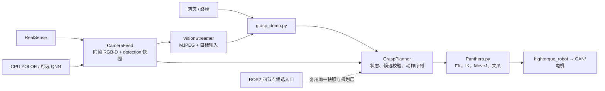

# Panthera-HT 彩色积木视觉抓取

这是运行在 IQ9075/AArch64 板端的 Panthera-HT 六轴机械臂抓取项目。默认流程为：网页或终端选择颜色，RealSense + QNN NPU YOLOE 识别积木，机械臂到预抓取观察位重新识别和校正，再执行最终接近、验夹紧力、放置和安全停机。语音模块暂时保留但默认关闭。

当前执行主线固定为单机单进程 `grasp_demo.py`。首次现场启动已确认相机、机械臂初始化和安全回零链路，但尚未完成一次全流程抓取验收；ROS2 代码仅保留备查，当前不作为运行入口。

## 2026-09-01 大修前检查点

本检查点保存此前的标定、NPU、网页控制、夹爪和安全生命周期修改，作为下一轮抓取逻辑大修的可回退基线。当前“网页能识别，但机械臂不能稳定开始抓取”的问题尚未关闭，已确认需要处理以下事项：

- 当前预抓取把夹爪直接旋到最终抓取朝向，并固定放在目标前 `0.05 m`。对于眼在手相机，这既可能移动过远，也可能在复检前把相机视线转离目标。后续版本将以 `/home/ubuntu/work/grasp_demo17.py` 为只读参考，重新比较“相机观察位”“当前距离比例”和带上下限的自适应退距，不再把固定 5 cm 当作最终设计。
- 当前预抓取后只接受一次新的推理结果；该帧漏检、颜色短暂波动或深度无效都会中断抓取。后续需要多帧复检、目标身份跟踪、颜色区域兜底，并把失败改为回识别位继续等待操作员选择。
- 当前扫描增加了速度连续稳定与推理期间关节漂移门槛，但 SDK 状态读取可能使用缓存反馈；必须先确认刷新语义，避免把已经停稳的机械臂误判为运动中。
- 网页采集帧和检测帧存在重复发布路径，需要保证 YOLO 框只绘制在产生该检测的同一 RGB 帧上，避免页面显示旧框而抓取线程的新帧没有候选。
- 当前 QNN `block4` context 仅在一张四积木静态场景上验证过召回；提示词数量、类别输出、NMS、掩膜质量、颜色二次分类、不同距离/角度的漏检率和误检率仍需分层审计。不能仅凭页面出现检测框判定 YOLO/NPU 链路已通过验收。

在上述大修完成和真机复验以前，本检查点不应被描述为“抓取功能已经验收通过”。

## 架构与数据边界



控制链与图像编码链分离。`VisionStreamer` 的 JPEG 编码在 HTTP 线程中完成，编码失败不会阻塞机械臂规划；网页提交的目标只进入一个受控命令槽，并由主循环解析。当前网页默认监听局域网 `0.0.0.0`，没有身份认证，只允许用于可信隔离局域网，不应转发端口或暴露到不受信网络。

## 默认单体流程

根入口是 `grasp_demo.py`：

1. 读取配置、启动展示旁路和 RealSense，再加载 NPU/CPU 视觉后端；视觉后端失败发生在机械臂初始化之前。
2. 创建 Panthera 机械臂拥有者和 `GraspPlanner`；后续异常统一进入清理路径。
3. 回 HOME、打开夹爪；通过终端或推流网页选择红/黄/蓝/绿/白/黑或任意颜色。网页只有在主程序处于“等待目标”阶段才接受提交，并要求现场安全勾选和二次确认。
4. J1 按已验证脚本的范围从 `+1.80` 扫到 `-1.80 rad`，步长 `0.30 rad`。每个扫描位等待指定数量的新推理快照；超时返回失败，绝不复用陈旧检测。
5. 默认 OBB/Seeed 后端，或显式启用 GraspNet；两者都会进入同一个 workspace、IK、FK 误差和关节跳变校验。
6. 当前基线由补偿后的最终夹爪末端位姿沿工具局部 `+X` 接近轴固定后退 `0.05 m` 得到预抓取位。以当前手工姿态计算，这约等于 Base `[-10.5, -5.8, +48.5] mm`，所以不是 Base 的单独 X/Y/Z，也不是球形欧氏半径。现场反馈表明该固定距离和姿态切换仍不合理，属于本轮大修对象。
7. 跳过自由空间预抓取只在有符号轴向距离位于 `0.02..0.05 m`、横向误差不超过 `15 mm`、姿态误差不超过 `8°` 时允许；处于目标平面之后或离目标过近仍会 fail-closed 中止。该容差与 IK 的 `8°` 姿态验收保持一致，修复了“候选先通过 IK、随后被更严格的 3° 预抓取条件拒绝”的矛盾。
8. 当前基线在预抓取后确认关节速度稳定，再获取一份新 RGB-D 推理结果并检查推理期间关节漂移。二次识别通过基座坐标最近邻保持原目标身份；目标变化后重新计算预抓取位并最多校正一次。单帧硬失败、缓存速度反馈和复检前相机朝向改变都是已知风险。
9. 最终接近不再使用 MoveJ，而是固定刷新后的姿态、按 `2 mm` 采样的笛卡尔直线路径。整段必须 100% 完成，逐点通过关节限位、跳变、FK、工作空间、轴向单调和横向误差检查；任何一步失败都不下发轨迹。最终位姿未稳定时禁止闭爪。
10. 抓取后检查夹爪位置/力矩；力不足时最多重新识别抓取一次。未夹到物体时打开夹爪并返回该目标最后一次识别位，程序不退出，网页重新开放目标选择；成功后 HOME → PUT1 → 释放 → PUT2。
11. `grasp_demo.py` 在接管机械臂后、执行 HOME 前立即记录六轴真实关节姿态。正常完成、网页结束、信号和异常路径都会调用有限时的 `safe_shutdown()`：先返回这份“程序启动前姿态”，确认位置/速度后 `set_stop()`。若反馈丢失，只在成功读取当前关节时做一次短暂保持后停机。ROS 兼容入口未提供启动快照时仍保留 ZERO 回退语义。

## 网页推流与目标输入

主程序启动后会打印实际地址，通常为：

```text
http://192.168.1.102:8080/
```

页面采用左右布局：左侧显示与彩色帧对齐的深度伪彩画面和深度范围/中值，右侧显示 YOLO 标注画面。标注包含检测置信度、颜色置信度、颜色累计帧数和目标深度。窄屏设备会自动改为上下布局。操作步骤：

1. 等待页面状态显示主程序正在等待目标。
2. 从下拉框选择颜色，或输入“不要红色，要绿色积木”等文本。
3. 确认机械臂所有路径内无人、无障碍物，勾选安全确认。
4. 点击“开始抓取”并通过浏览器二次确认；提交成功后自动开始扫描。
5. 未抓到物体时，等待机械臂回到最后识别位，再在同一页面选择下一个目标。
6. 需要正常结束时点击“结束程序并回启动姿态”；后端锁存一次请求、禁止继续提交目标，机械臂确认回到程序接管前的真实六轴姿态后停止电机。

网页按钮不是急停，也不能替代现场人员、硬件急停和安全围栏。网页没有登录鉴权；后端在非目标输入阶段拒绝请求，但同一可信局域网内能访问页面的人仍可能提交目标。

配置中的 HOME 是抓取流程工作姿态，不等同于“程序启动前姿态”。后者每次运行都从电机反馈动态记录，不能硬编码。`safe_shutdown()` 的故障回退是有限时间的，不会永久占用工作线程；它不替代现场急停、硬件限位或碰撞规划。

## 标定

项目根目录的 `hand_eye_calibration.json` 是唯一手眼标定来源。当前版本由只读来源文件复制而来：

```text
标定时间：2026-08-31 07:18:17
样本数：20
字段：T_tcp_camera
```

运行时使用：

```text
T_base_camera = T_base_tcp × T_tcp_camera
```

`T_base_tcp` 由当前（与感知快照绑定的）机械臂关节位姿 FK 得到。单体和 ROS2 均指向同一项目内标定文件，没有第二份硬编码基座/手眼矩阵。

新旧标定的 TCP→Camera 变换约相差 1.93 mm、1.86°。更换相机、TCP、末端工具或机械臂基座后必须重新标定；仅复制 JSON 不构成真机验证。

## 目录

```text
pathera_grasp/
├── grasp_demo.py                         # 单体正式入口
├── voice_controller.py                   # 离线 ASR/TTS 半双工胶水层
├── hand_eye_calibration.json             # 当前手眼标定（唯一来源）
├── models/                               # YOLOE、SenseVoice、VITS 模型（Git LFS）
├── iq9075_speech/ iq9075_tts/ voice_demo/# 语音组件与独立演示
├── Panthera-HT_SDK/panthera_python/
│   └── scripts/Panthera_lib/
│       ├── Panthera.py                   # 电机、FK/IK、MoveJ
│       ├── grasp_config.py               # 共享配置/颜色解析
│       ├── grasp_planner.py              # 状态、候选验证、执行、停机
│       ├── vision_pipeline.py            # RGB-D 快照、检测、坐标/OBB
│       ├── graspnet_pipeline.py          # 可选 GraspNet 候选
│       ├── npu_inference.py              # QNN 进程/FIFO 健康检查
│       └── vision_streamer.py            # 网页 MJPEG
├── ros2_ws/src/                          # voice、vision、stream、grasp_brain、bringup
├── tools/test_graspnet_offline.py        # GraspNet 离线候选脚本
├── tools/run_offline_tests.py            # 标准库 unittest + 内存编译
└── tests/                                # 不接硬件的回归测试
```

`ros2_ws/` 仅作为暂停的兼容实现随检查点保存；不要同时启动它和 `grasp_demo.py`，否则会争用相机和机械臂。

## 配置与启动

项目目标环境：

```bash
source /home/ubuntu/miniconda3/etc/profile.d/conda.sh
conda activate pathera_grasp
cd /home/ubuntu/A_shen_arm/pathera_grasp
export VOICE_INPUT=0
export YOLO_NPU=1
export GRASPNET_USE=0
python grasp_demo.py
```

上面的主流程会触发硬件，必须在单独授权和现场安全检查后才可执行。本次没有执行它。

常用环境变量：

| 变量 | 默认 | 用途 |
|---|---:|---|
| `YOLOE_MODEL_PATH` | 项目内 `yoloe-26s-seg.pt` | CPU YOLOE 权重 |
| `YOLOE_TEXT_ENCODER_PATH` | `mobileclip2_b.ts` | YOLOE 文本编码器 |
| `YOLO_NPU` | `1` | 默认 QNN HTP NPU；设为 `0` 才使用慢速 CPU 回退 |
| `REALSENSE_SERIAL` | 空 | 多相机时绑定指定 RealSense 序列号 |
| `GRASPNET_USE` | `0` | 启用 GraspNet 候选 |
| `GRASPNET_CHECKPOINT_PATH` | 项目内 checkpoint | 覆盖 GraspNet 权重 |
| `VOICE_INPUT` | `0` | 暂缓整合；显式设为 `1` 才启用离线语音 |
| `VOICE_PROMPT_DURATION` | `3.5` | 单次语音录音时长 |
| `VISION_STREAM_HOST/PORT/JPEG_QUALITY` | `0.0.0.0/8080/92` | MJPEG 服务；相机采集保持稳定的 30 FPS，NPU 检测帧率由实际推理速度决定 |

`grasp_config.py` 中 `npu_response_timeout` 和 `npu_stderr_max_lines` 用于限制 QNN FIFO 阻塞和 stderr 内存；不再保留未实现的 GraspNet 点云半径、lift、可操作度或自动稳定样本伪配置。

当前夹爪安全范围保持为 `0.0..2.0 rad`；根据重新置零后反复验证的 `grasp_demo15.py`，完全打开目标更新为 `1.8 rad`，闭合目标为 `0.0 rad`，近闭合阈值为 `0.22 rad`。若再次执行电机零位标定，必须重新确认这些值。

HOME 与抓取补偿按现场反馈恢复为相互配套的上一版参数；PUT1、PUT2 保持已验证值：

```text
HOME         = [0.000, 0.240, 1.200, -1.515, 0.000, 0.000]
PUT1         = [1.600, 1.300, 0.550, -0.300, 0.000, 0.000]
PUT2         = [1.500, 0.500, 0.560, -0.075, 0.000, 0.000]
GRASP_OFFSET = [0.150, 0.040, -0.070] m
```

与该补偿配套的工作空间保护同步为：tool X `0.10..0.60 m`、Y `-0.45..0.45 m`、Z `0.00..0.30 m`、径向 `0.10..0.65 m`。

现场截图复算说明了旧 HOME 不能与新版 `Z=-0.150 m` 补偿混用：截图目标的 Base Z 约为 `0.104..0.106 m`，叠加后 Tool Z 约为 `-0.046..-0.044 m`，必然被 `tool_z >= 0` 工作空间保护拒绝。恢复配套的 `Z=-0.070 m` 后 Tool Z 约为 `0.034..0.036 m`，重新进入合法工作空间；没有为掩盖坐标错误而关闭工作空间保护。

## 视觉、GraspNet 与 NPU

- 默认检测改为 QNN HTP NPU。程序在机械臂初始化和运动之前加载视觉后端；NPU 启动失败时不会移动机械臂，可显式 `YOLO_NPU=0` 使用 CPU 回退。日志中的 `selected backend` 和周期性 `[VISION-PERF]` 会分别报告后端、相机采集 FPS、检测 FPS 与单帧推理耗时。
- NPU 使用从只读参考环境复制到项目内的 `yoloe-26s-seg_640_iq9075_qnn_block4.bin`，其四个编译提示词是通用积木同义词；颜色仍由 HSV 独立判断。旧 `brick6` 上下文把颜色写进检测提示词，与当前“先检测积木、再判色”的管线不匹配：在同一张四积木截图上即使阈值降到 `0.15` 仍输出 0 个候选。`block4` 在 `0.15` 下输出 4 个候选，单次 NPU 推理约 `0.085 s`，因此当前阈值设为 `0.15`，不是用降阈值掩盖 NPU 故障。
- NPU 后处理先执行 top-k 和 class-agnostic NMS，再为保留候选解码 prototype mask。FIFO 超时或短读后会立即关闭并毒化该检测器；由于协议没有 request id，禁止复用可能含迟到旧响应的连接。可用 `tools/diagnose_npu_models.py` 对同一静态图片比较多个 QNN context，无需启动相机或机械臂。
- 相机仍从设备读取真实 `depth_scale`，不会把日志中的 `0.00010` 擅自硬改成 `0.001`。启动日志增加产品型号和序列号；多相机可用 `REALSENSE_SERIAL` 绑定。
- 深度不再对整个掩膜简单取中位数，也不再把独立统计的 `(u,v)` 与 `z` 拼成一个不存在的点。现在从自适应掩膜核心中，以近表面分位数建立深度带、剔除孔洞/孤立近点，并从同一组像素共同计算 `(u,v,z)`；深度带离散度过大直接拒绝检测。
- YOLOE 负责“积木”目标检测，颜色由检测掩膜内的 HSV 二次分类完成。上传截图中黄色顶面色相中位数约为 `H=27`，浅绿色顶面约为 `H=42`；旧边界 `H=45` 会把浅绿色投票到黄色，现将黄/绿边界校准为 `H=38`。
- 颜色判断采用自适应掩膜核心，不再用固定腐蚀核吃掉小积木；除主色占比外还检查第一、第二颜色的票数差。单帧证据不足时，仅在机械臂静止且目标基座位置相差不超过 `20 mm` 时合并最多 5 帧证据。网页标注会直接显示颜色置信度和累计帧数，便于现场继续校准。
- 默认抓取为 OBB/Seeed 几何姿态。`GRASPNET_USE=1` 仅在离线候选确认和低速真机授权后使用。
- GraspNet 从目标 bbox 外扩的局部 RGB-D 场景生成候选。候选统一经过 workspace、IK、FK/关节跳变检查；碰撞过滤异常时直接丢弃候选（fail-closed），NMS 返回值会被接住，反向 180° 接近姿态不再被误判为合格。
- OBB 与 GraspNet 当前共用固定 5 cm 预抓取、目标身份保持、重新识别、再对齐与笛卡尔最终接近。固定退距和复检方式是已知待修问题；大修前仍保持 fail-closed，不退回未经校验的 MoveJ 直抓路径。

当前预抓取安全语义参照 MoveIt 的 `GripperTranslation`，但固定 5 cm 只是此前实现，不代表现场最优值。下一版需要把“期望退距、最小退距、最大退距、相机可见性和当前 TCP 到目标距离”共同纳入策略。项目当前不启用 ROS2，只复用几何和安全语义。参考：[MoveIt Pick and Place](https://moveit.picknik.ai/main/doc/examples/pick_place/pick_place_tutorial.html)、[MoveIt Task Constructor](https://moveit.picknik.ai/main/doc/tutorials/pick_and_place_with_moveit_task_constructor/pick_and_place_with_moveit_task_constructor.html) 和 [ROS GripperTranslation](https://docs.ros.org/en/noetic/api/moveit_msgs/html/msg/GripperTranslation.html)。

离线 GraspNet 脚本会从 `mask.png` 推导 `bbox`，不再因 `detection["bbox"]` 缺失崩溃：

```bash
python tools/test_graspnet_offline.py \
  --data-dir /path/to/saved_frame \
  --checkpoint third_party/graspnet-baseline/checkpoint-rs.tar
```

## 语音

语音模块当前暂缓整合，主流程默认 `VOICE_INPUT=0`。显式设置 `VOICE_INPUT=1` 后可使用 CPU 离线后端：SenseVoice ASR + sherpa-onnx VITS TTS；`VoiceInterface` 在开始录音前等待 TTS 队列/播放器结束，并保留短暂声学消退时间。

颜色解析会忽略明确否定，例如“不要红色”不再自动抓红色；“不要红色，要蓝色”会选择蓝色。详见 [VOICE_SETUP.md](VOICE_SETUP.md)。

## ROS2 暂停入口

当前同机部署不使用 ROS2，正式运行只执行根目录 `grasp_demo.py`。以下 ROS2 工作区和通信说明仅保留供后续跨进程/跨机器需求使用，不参与当前真机验收，也不得与单体入口同时启动。

ROS2 把单体拆为 `panthera_voice`、`panthera_vision`、`panthera_stream` 和 `panthera_grasp_brain`。旧 topic 保持不变，新增兼容 topic：

```text
/vision/detections_stamped  std_msgs/String JSON
{
  "frame_seq": 123,
  "capture_timestamp_ns": 123456789,
  "detections": [ ... ]
}
```

vision 节点在 `Image.header.stamp` 写入相同 `capture_timestamp_ns`；grasp brain 只在 RGB、depth 和 `detections_stamped` 三者时间戳匹配时构造抓取快照。`/vision/camera_info` 改为 reliable + transient-local 并每 5 秒重发，消除 late-joiner 竞态。`use_voice:=false` 同时传给 voice node 与 brain，brain 不再请求语音。

构建命令：

```bash
source /opt/ros/humble/setup.bash
source /home/ubuntu/miniconda3/etc/profile.d/conda.sh
conda activate pathera_grasp
cd /home/ubuntu/A_shen_arm/pathera_grasp/ros2_ws
colcon build --symlink-install \
  --packages-select panthera_voice panthera_vision panthera_stream \
  panthera_grasp_brain grasp_bringup
source install/setup.bash
bash patch_shebangs.sh
```

本机 `/usr/bin/python3` 是 Python 3.12，而 ROS Humble `rclpy` 是为 Python 3.10 编译的。每次 `colcon build` 后必须执行 `bash patch_shebangs.sh`，把生成的节点入口固定到依赖齐全的 `pathera_grasp` Python 3.10 环境；脚本会先验证 ABI 和视觉依赖再修改入口。实际节点联调仍须按下方真机前处理流程逐级进行。详情见 [ros2_ws/README.md](ros2_ws/README.md)。

## 离线验证

以下命令不创建硬件入口、不调用机械臂/相机/NPU/声卡：

```bash
source /opt/ros/humble/setup.bash
source /home/ubuntu/miniconda3/etc/profile.d/conda.sh
conda activate pathera_grasp
cd /home/ubuntu/A_shen_arm/pathera_grasp
PYTHONDONTWRITEBYTECODE=1 python tools/run_offline_tests.py
```

它会内存编译白名单 Python 文件，并运行配置/语音、标定、IK、快照新鲜度、工作空间、停机故障、NPU 超时和 ROS 通讯契约测试。

本次精度修改的正式目录离线结果：37 个 Python 文件内存编译成功，33 项回归测试全部通过。测试覆盖 NPU NMS、稳健近表面深度、有符号预抓取、偏轴/越界拒绝、笛卡尔路径单调性和部分路径 fail-closed；仍不代表真机轨迹、碰撞或最终抓取精度已经验收。

## 仍需真机前处理的边界

- 当前项目没有经验证的环境/自碰撞规划。最后接近虽已改为逐点校验的笛卡尔直线，但 `compute_cartesian_path(..., avoid_collisions=False)` 不提供环境碰撞检测，现场障碍清除和急停仍是硬要求。
- 电机 YAML 中的硬件限位/力矩保护配置不在本次白名单，未作修改。
- 新标定只做了矩阵合法性和离线加载检查，未做抓取精度、轨迹、急停或相机序列号匹配验证。
- ROS2 兼容源码随大修前检查点保存，但当前运行主线仍为单体 `grasp_demo.py`，ROS2 不参与本轮真机验收。
