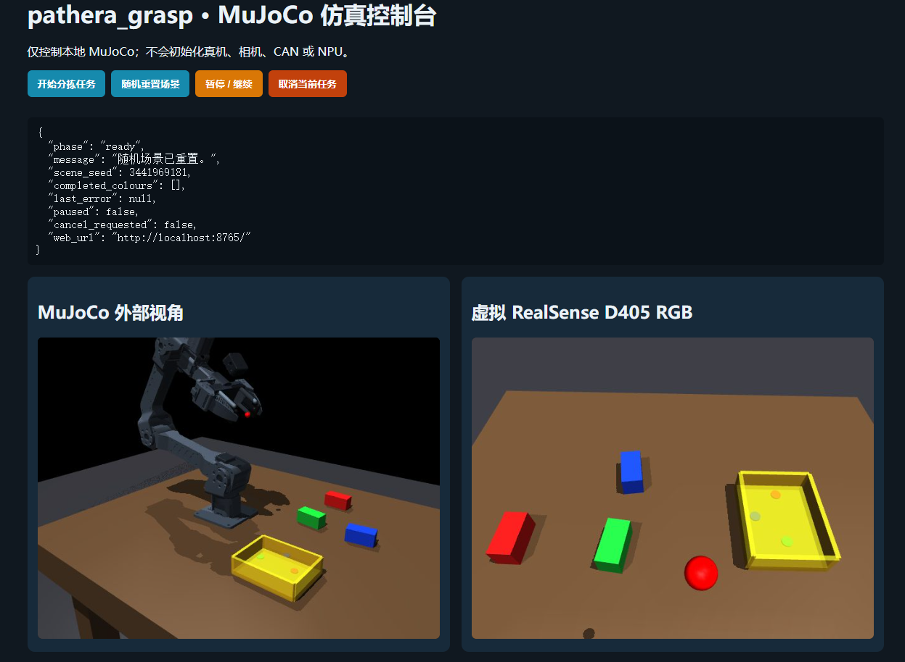
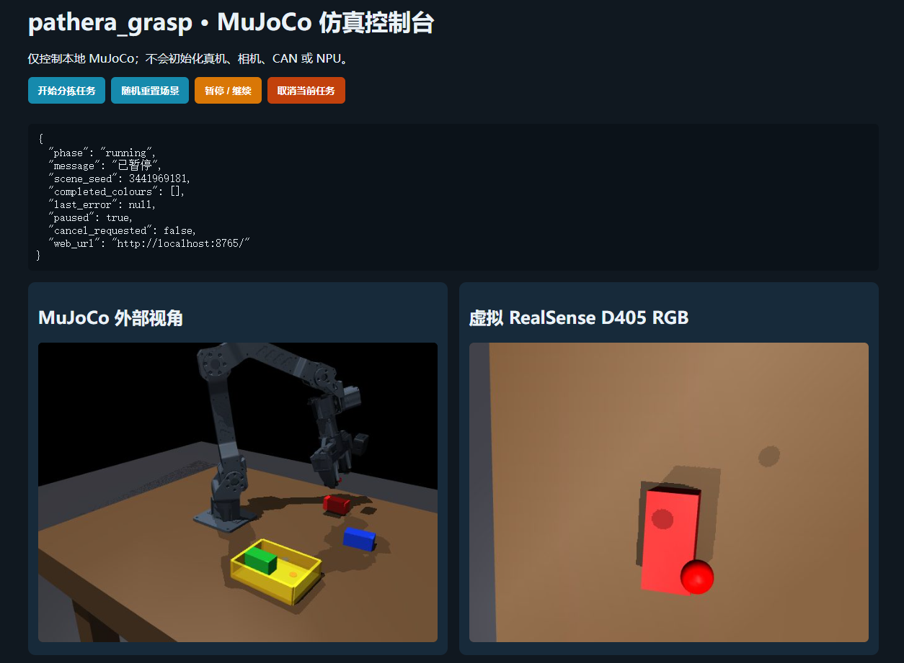

# Panthera-HT MuJoCo 仿真模块

`sim/` 是与真机入口隔离的 WSL2/PC 仿真模块，用于验证机械臂几何、虚拟 RGB-D、目标识别、Pinocchio 逆运动学、抓取顺序和网页状态机。正式真机入口仍是根目录 `grasp_demo.py`；仿真必须从根目录 `run_mujoco.py` 启动。

仿真入口不会导入 Panthera SDK、CAN、`pyrealsense2`、QNN/NPU、ROS2 或语音模块，也不会连接 IQ9075。仿真依赖是 Linux x86_64 环境专用依赖，禁止安装进板端 `pathera_grasp` 环境。

## 已实现能力

- Panthera-HT 六轴运动链、惯量、关节限位和位置执行器。
- 官方本体 STL 外观、简化碰撞体和无官方 CAD 时的代理夹爪。
- 虚拟 RealSense D405 外观、腕部 RGB-D、内参及世界坐标反投影。
- 红、绿、蓝三块 3×3×6 cm 积木，可通过场景种子复现布局。
- 确定性颜色检测，以及单绿色积木的 Ultralytics YOLO 回归模型。
- Pinocchio 6D IK、预抓取、工具轴接近、双指接触、抬升和 PUT1 验证。
- EGL 无窗口运行、外部视角录像、WSLg Viewer、虚拟 D405 窗口和浏览器控制台。

## 运行效果

### 任务开始：物块随机摆放



控制台进入 `ready` 状态后，可通过“随机重置场景”生成新的 `scene_seed`。左侧为 MuJoCo 外部视角，右侧为腕部虚拟 RealSense D405 RGB 画面。

### 抓取红色物块



抓取任务运行时，外部视角用于观察整机姿态和物块位置，腕部画面用于核对末端接近目标时的相机视野。截图中任务处于暂停状态，可通过网页继续执行。

## 与真机流程的区别

当前 `sort` 是仿真专用的确定性集成回归：绿色、红色、蓝色会自动依次抓取并放到 PUT1。真机主线则是单目标抓取后进入 `FULL_LOAD`，回 HOME 保持夹紧，等待操作者点击“放置”，再执行 PUT2/PUT1 序列。

因此，当前仿真能证明 RGB-D、坐标、IK、接触检查和任务顺序可运行，但还不能证明真机 `FULL_LOAD` 状态机已经被逐状态复现。

仿真在双指接触和力阈值通过后会把积木作为受控持有物同步到夹爪；PUT1 验证后会锁定已放置积木。这是为了获得稳定、可复现的回归结果，不等同于完全依赖摩擦与柔顺接触的自由物理抓取。

## 环境

推荐使用独立 Conda 环境，不要复用真机环境：

```bash
source /home/ros/miniconda3/etc/profile.d/conda.sh
conda create -n pathera_mujoco python=3.10 -y
conda activate pathera_mujoco
conda install -c conda-forge pinocchio -y
export PYTHONNOUSERSITE=1
python -m pip install -r requirements-sim.txt
```

所有命令从仓库根目录执行：

```bash
export PYTHONNOUSERSITE=1
export PYTHONPATH=$PWD
```

## 快速运行

无窗口三色分拣：

```bash
export MUJOCO_GL=egl
python run_mujoco.py --mode sort --detector colour --scene-seed 20260904
```

只验证 RGB-D 与颜色识别：

```bash
export MUJOCO_GL=egl
python run_mujoco.py \
  --mode recognition \
  --detector colour \
  --target-color green \
  --scene-seed 20260904
```

使用仓库自带的合成 YOLO 权重抓取绿色积木：

```bash
export MUJOCO_GL=egl
python run_mujoco.py \
  --mode grasp \
  --detector yolo \
  --target-color green \
  --scene-seed 20260903
```

网页双路视频控制台：

```bash
export MUJOCO_GL=egl
python run_mujoco.py --mode sort --detector colour --web
```

浏览器打开 `http://localhost:8765/`。服务默认只监听 `127.0.0.1`，不要在不了解局域网暴露风险时改成 `0.0.0.0`。

WSLg 外部视角和虚拟 D405 窗口：

```bash
unset MUJOCO_GL
python run_mujoco.py \
  --mode sort \
  --detector colour \
  --viewer \
  --camera-view
```

## 测试

```bash
export MUJOCO_GL=egl
export PYTHONNOUSERSITE=1
export PYTHONPATH=$PWD
python -m unittest discover -s sim/tests -v
```

测试覆盖入口硬件隔离、MJCF 与当前 HOME/TCP/手眼标定的一致性、RGB-D、三色定位、YOLO、MuJoCo/Pinocchio FK 一致性、接触与抬升、三色 PUT1 以及网页命令状态机。缺少可选依赖时出现的 `skipped` 不能当作通过。

## 目录

| 路径 | 作用 |
|---|---|
| `mujoco_backend.py` | 模型、控制、RGB-D、随机场景、接触和持物回归 |
| `grasp_pipeline.py` | 识别、IK、预抓取、抓取、抬升和 PUT1 分拣 |
| `detection.py` | 颜色检测与 Ultralytics YOLO 适配 |
| `ik.py` | Pinocchio FK/IK |
| `live_viewer.py` | WSLg 外部 Viewer 和虚拟 D405 窗口 |
| `recording.py` | 外部视角 MP4 录像 |
| `web_dashboard.py` | 本机网页、命令互斥和双路 MJPEG |
| `models/` | MJCF 场景和合成 YOLO 权重 |
| `assets/` | Panthera、D405 外观资源及许可证 |
| `scripts/` | 仿真任务、合成训练和网格处理工具 |
| `tests/` | 不访问硬件的仿真回归测试 |

详细操作与排错见 [MuJoCo 使用教程](../docs/mujoco_guide.md)，阶段验收记录见 [TASK-005 归档报告](../docs/archive/TASK-005-mujoco-report.md)。
